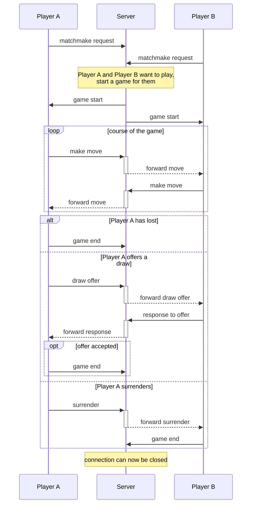

# Chess
An online chess game
## Základní charakteristika

Program Chess umožňuje hru proti člověku (u stejného počítače nebo po síti) nebo proti počítači ("umělá inteligence"). Kontroluje a napovídá platné tahy jednotlivých figur podle šachových pravidel. Umožňuje provést rošádu, en passant i proměnu pěšce. Každému hráči běží šachové hodiny. Před zahájením hry je možné manuálně rozestavět figury s kontrolou platnosti rozložení. Rozehrané partie lze uložit a načíst ve standardním PGN formátu. Sehrané partie lze v PGN formátu načíst a prohlížet.

Šachový server umí zprostředkovat síťové hry více dvojic hráčů. Udržuje statistiky her.

## Menu

Po spuštění hry se uživatel ocitne ve hlavním menu, kde má na výběr několik možností (viz obrázek). Tlačítko „Human vs. human local“ zvolí hru proti člověku a objeví se okno s šachovnicí pro hru. Stisknutím tlačítka „Human vs. AI local“ vybere hru proti počítači - hráč si nejdříve v dialogovém okně vybere svojí barvu, se kterou chce hrát. Stisknutím tlačítka „Human vs. human online“ vybere hru proti člověku po síti prostřednictvím šachového serveru. Po jeho stisknutí se objeví se dialogové okno, ve kterém hráč vyplní své uživatelské jméno. Volba „Server statistics“ zobrazí historii her, které udržuje šachový server. Zmáčknutím tlačítka „Quit“ se zavře program.


## Hra

Na začátku hry se kameny postaví do výchozího (základního) postavení. Stisknutí tlačítek „Menu”, „Restart”, „Save”, „Load” a „Create” slouží k návratu do hlavního menu, restartování hry, uložení a načtení rozehrané partie a manuálnímu rozestavění figur (tato funkce je popsána dále v této dokumentaci). Tlačítka „Save” a „Load” vyvolají dialog pro výběr umístění souboru PGN, který chce uživatel uložit nebo načíst.


Hráči na tahu se všechny figury, kterými lze táhnout, zvýrazní žlutou barvou. Z těchto figur si hráč kliknutím myši vybere figuru, kterou chce táhnout. Tím se všechna pole, na které lze táhnout danou figurou, zvýrazní zelenou barvou. Kliknutím na zvolené zelené pole hráč provede tah vybranou figurou na toto pole.


Ve hře platí pravidlo „dotknuto-hráno“. To znamená, že pokud se hráč na tahu záměrně dotkne kamene na šachovnici, se kterým lze podle pravidel táhnout, pak s ním musí táhnout.

### Konec hry

Když hráč zvítězí/prohraje, jeho hodiny se rozsvítí zelenou/červenou barvou. Pokud hráči vyprší čas, prohrává. V případě remízy se hodiny obou hráčů rozsvítí žlutou barvou.


### Síťová hra

V síťové hře není možné restartovat hru, načíst rozehranou partii z PGN ani manuálně rozestavět figury před zahájením partie. Místo nich přibyly tlačítka „Draw offer” a „Surrender”. Tlačítko „Draw offer” odešle nabídku remízy soupeři, ten ji může přijmout, nebo odmítnout. Pokud ji přijme, partie končí remízou; pokud odmítne, pokračuje se v partii. Tlačítkem „Surrender” hráč kapituluje a tím okamžitě ukončí hru uznáním své prohry.


## Manuální rozestavění figur

Režimy „Human vs. human local“ a „Human vs. AI local“ umožňují před začátkem hry manuálně rozložit figury stiskutím tlačítka „Create”. Tím se šachovnice uvede do standardního rozložení. Stisknutím pravého tlačítka myši na libovolném poli šachovnice se zobrazí kontextová nabídka. Obsahuje volbu „Remove Figure“, která slouží k odstranení figury na zvoleném poli. Dále obsahuje volby pro přidání (Add) bílé (White) nebo černé (Black) dámy (Queen), střelce (Bishop), jezdce (Knight), věže (Rook) nebo pěšce (Pawn). Krále nelze přidávat ani odebírat, pouze přesouvat. Výběr figury se provede kliknutím levým tlačítkem myši; dalším kliknutím se tato figura přesune na vybrané pole šachovnice.


Je možné si aktuální rozestavění uložit do PGN formátu pomocí tlačítka „Save” nebo načíst rozložení z existujícího PGN souboru pomocí „Load”.

Hra se z tohoto rozložení zahájí tlačítkem „Start“.

## Prohlížení statistik serveru

Historie her odehraných na serveru lze zobrazit zvolením „Server statistics“ v hlavní nabídce.


Zobrazení seznamu her pro konkrétního uživatele se provádí vyplněním textového pole „Filter by name“ a stiknutím tlačítka „Search“, případně stiskem klávesy <kbd>Enter</kbd> při kurzoru umístěném v textovém poli. Vymazání a potvrzení filtru na jméno vede ke zrušení filtru - tím se v tabulce opět objeví všechny hry. Tlačítko „TOP 10 games“ zobrazí pouze nejdelších 10 her. Tlačítkem „Menu“ uživatel přejde do hlavního menu.

## Přípravná fáze

- pouze v lokální hře u jednoho počítače, nikoli síťové hře - tj. pouze člověk proti člověku nebo člověk proti počítači - zatím bez hráčů
  - možnost manuálního rozmístění figurek uživatelem (jeden uživatel rozmísťuje černé i bílé figury)
    - výchozí je standardní rozložení dle šachových pravidel
    - konečné rozložení musí odpovídat situaci, která se může vyskytnout v průběhu šachové partie
    - k dispozici jsou tlačítka na vyčištění celé šachovnice (tj. odstranění všech figurek, které tam právě jsou) a na obnovení standardního rozložení (to také odstraní všechny figury, které tam byly)
    - uživatel si může v průběhu rozmísťování na jakékoli políčko šachovnice umístit libovolnou šachovou figuru
    - umístěné figury lze přesouvat, odstraňovat
    - někde na straně se budou zobrazovat průběžné počty jednotlivých typů figur; program bude tyto počty průběžně kontrolovat a **červeně** zvýrazňovat ty, které odporují šachovým pravidlům (při najetí na začerveněný počet se může objevit popisek s vysvětlením, jak to pravidlům odporuje)
      - standardní počty jsou (celkem 16 figur jedné barvy):
        - 8 pěšců
        - 2 věže
        - 2 střelci (1 černopolný, 1 bělopolný)
        - 2 jezdci
        - 1 dáma
        - 1 král
      - kvůli proměně pěšců lze z maximálního počtu 8 pěšců přelévat do počtu věží, střelců, jezdců nebo dam
      - vždy musí být právě 1 král, všech ostatních figur může být méně (mohly být vyhozeny)
    - z pravidel, jak se mohou jednotlivé figury pohybovat, vyplývají další omezení:
      - pěšci mohou táhnout na volná pole pouze dopředu (začínají v 2. řadě, tedy nemohou se dostat do 1. řady) a nemohou být v poslední řadě, protože tam se musí proměnit na věž, střelce, jezdce, nebo dámu; mohou brát figury soupeře šikmo dopředu
      - věž, jezdec, dáma i král se nakonec můžou dostat na všechny pole šachovnice, omezení nejsou
      - počáteční střelci se můžou dostat pouze na pole stejné barvy jako na poli, na kterém začali
        - to by sice platilo i pro střelce vzniklé proměnou z pěšců, a pěšci můžou normálně jenom směrem dopředu, ale můžou i vyhazovat šikmo dopředu, takže teoreticky může být 8 bělopolných střelců vzniklých proměnou, pokud došlo k vyhození příslušného počtu soupeřových figur (tady už by se to nepříjemně komplikovalo, proto na poměr černo/bělopolných střelců program omezení klást nebude)
      - program nebude uvažovat nemožnost figur přeskakovat jiné figury (to by bylo neúměrně složité)
      - hráč, který z pohledu na počáteční rozmístění figur hrál jako poslední (tedy ten, kdo v této partii s upraveným rozložením nebude hrát jako první), nemohl nechat svého krále ohroženého šachem, tedy král nezačínajícího hráče nesmí být v šachu
    - na pěšce v nesprávných řadách lze upozornit červeným vybarvením políčka, na kterém pěšec stojí
    - na chybný počet černopolných / bělopolných střelců lze upozornit v tabulce počtů figur, kde kromě celkového počtu střelců jedné barvy (tj. patřící jednomu hráči) bude napřiklad v závorce počet bělopolných a černopolných střelců umístěných na šachovnici (nesprávný počet se opět červeně zvýrazní)
    - uživatel musí programem nahlášené problémy vyřešit před tím, než by s vytvořeným rozložením chtěl zahájit hru

- po potvrzení počátečního rozložení figur se program zeptá na jména hráčů, kteří budou hrát proti sobě, poté se hra zahájí

## Hra

Player A - černý\
Player B - bílý

čeká se na A
- klikne na svojí figuru a zobrazí se mu platné tahy
  - zavolá se metoda `board.getValidMoves`
- klikne na nějaké jiné pole
  - GUI ví pozici na šachovnici, kam byl pokus táhnout (-> tuto pozici přepošle modelu)
  - model překontroluje platnost tahu
    - pokud je neplatný, program se vrátí neúspěšně do GUI obsluhy události a přesun se neprovede (nic se nestane, nebo se pole vyčervení)
    - pokud je platný, model vykoná tah
- po každém tahu se překreslí celá šachovnice podle modelu
- po dokončení tahu se pozastaví šachové hodiny hráče a spustí se hodiny soupeře
- vyčká se, až dohraje soupeř

---

## Rozbor šachových pravidel a jejich implementace

- co se může stát při tahu:
  - když se táhne na volné pole (a nedojde k en passant), figura se přesune na určené místo
  - když je možné táhnout na políčko se soupeřovou figurou, pak je soupeřova figura vyhozena a místo ní se tam přesune aktivní figura
  - pokud se s pěšcem táhne na poslední řadu desky, pěšec se tam přesune a vzápětí se ukáže dialogové okno pro výběr proměny figury (věž, střelec, kůň, dáma). Po výběru se figura pěšce nahradí vybranou figurou.
  - pokud se táhne pěšcem na volné pole a dojde k en passant, tak se současně s přesunem vyhodí i soupeřův pěšec
  - když se táhne králem na rošádu, spolu s přesunutím krále se přesune i příslušná věž

- Metoda `getValidMoves()` jednotlivých figur by měla řešit jejich specifické chování, nikoli to, zda je král v šachu a je tedy přípustné dělat pouze takové tahy, kterými se šach odvrátí. To je třeba dělat na společném místě. Možná `board.getValidMoves(figure)`, která bude filtrovat `figure.getValidMoves()` podle toho, jestli by po provedení tahu byla `board.getKing(color).isInCheck()` pravda, nebo ne.
- bude pravděpodobně užitečné poskytnout v abstraktní `Figure` nějaký getter `isFirstMove()`, protože s touto informací bude pracovat hned několik figur:
  - pěšec: aby věděl, jestli je povoleno postoupit o dvě pole, nebo ne;
  - král + věž: pokud se s nimi hýbalo, rošáda není možná.
- en passant lze použít jen tehdy, když soupeřův pěšec v bezprostředně předcházejícím tahu postoupil o dvě pole. Proto by `Pawn` měl asi rozšířit společnou metodu `Figure.move()`, aby si při detekci tahu o dvě pole mohl poznamenat, že je ho možné v dalším tahu vyhodit en passantem. Po jakémkoliv tahu soupeře se musí tento příznak vyresetovat (pokud je ovšem pěšec stále na šachovnici).

  Nutnost vyresetování ale zní dost problematicky, protože nějaký objekt, který ví o všech tazích, musí dát pěšcovi vědět, že si má tento příznak vyresetovat. To nevypadá jako dobré řešení.

- jak implementovat `King.isInCheck()`? Podívá se na všechny soupeřovy figury a zkontroluje, zda některý z jejich platných tahů nevede přímo na pozici krále, pro kterého zjišťuji šach.
  - Pozn.: při určování platných tahů soupeřových figur není nutné zjišťovat, zda je soupeř v šachu, protože podle šachových pravidel nemůže být. V předcházejícím tahu totiž případný šach musel vyřešit.
  - Pozn.: "En passant" je jediný tah v šachu, kdy se odebere kámen soupeře jinde než na poli, na které se přesouvá vyhazující figura. Ovšem tím lze brát pouze pěšce, nikoli krále, takže tento případ zde není nutné uvažovat.
- Společná metoda `board.getValidMoves(figure)` dostane nevyfiltrované možné tahy od `figure.getValidMoves()`, které musí filtrovat tak, aby zůstaly jen ty, po kterých král nebude v šachu. To lze nejsnáze udělat tak, že každý možný tah odsimuluje na herní desce a poté se zeptá `isInCheck()`, zda tah končí v šachu. Pokud ano, tah je vyřazen jako neplatný; v opačném případě je platný. Každopádně se herní deska samozřejmě po odsimulování tahu vrátí do původního stavu.
  - To je implementačně jednoduché, s herní deskou `Figure[][]` si stačí před provedením tahu zapamatovat hodnotu typu `Figure` (která ovšem může být `null`) na pozici, kam testovaný tah vede, a dosavadní pozici `figure` nastavit v desce na `null`.
    - Tohle nestačí pro en passant, protože ovlivňuje nejen výchozí a cílové pole tahu, ale i jiné pole, jehož stav je rovněž nutné vrátit zpět.
    - Rošáda (tj. tah krále) by sice ovlivnila kromě tažené figury i další figuru (věž), ale tady v `board.getValidMoves` nebudeme simulovat, zda rošáda vede do šachu, nebo ne. To by totiž byla jen částečná (neúplná) kontrola platnosti tahu - ve skutečnosti se musí ověřit, zda na _žádném_ z polí, na kterých se král pohybuje při rošádě, by nebyl v šachu (nestačí jen to, že na _koncovém_ poli není v šachu). To se tedy stejně musí dělat v metodě `king.isCastlingPossibleWith(rook)` a tam to dává větší smysl, takže dělat to tady znova by bylo duplicitní a navíc by to zkomplikovalo zdejší obnovení herní desky do původního stavu po odsimulování tahu (právě proto, že ovlivňuje ještě věž).

      To však znamená, že je v seznamu od `figure.getValidMoves()` nutné vždy vyloučit tah rošády ještě předtím, než by byl vpuštěn do simulace. Tedy nejdřív se odfiltruje rošáda (tu tady simulovat nebudeme; absolutní platnost rošády se ověří už dříve) a až tento předfiltrovaný seznam tahů se tady bude simulovat.

      Pak je otázka, jestli bude `king.getValidMoves()` tah rošády vůbec zahrnovat.


- rošáda
  - Všechny podmínky ([https://cs.wikipedia.org/wiki/Rošáda#Definice](https://cs.wikipedia.org/wiki/Ro%C5%A1%C3%A1da#Definice)):
    1. králem nebylo ještě táhnuto (`king.isFirstMove()`)
    2. s příslušnou věží nebylo ještě táhnuto (`rook.isFirstMove()`)
    3. mezi králem a věží nestojí žádná jiná figura
    4. král nesmí přejít přes žádné pole, které ohrožuje nepřátelská figura (byl by v šachu)
    5. král před provedením a po provedení rošády nestojí v pozici šach
    6. král a vybraná věž musí stát na stejné řadě
  - Opět se zde uplatní simulace tahů (stejně jako v `board.getValidMoves()`). Král nesmí být v šachu před provedením rošády, nesmí šachem projít ani v šachu skončit.
  - Mít `king.isCastlingPossible()` nestačí, protože to nerozlišuje mezi tím, zda je možné provést malou rošádu nebo velkou (případně obě). Klidně se může stát, že se s jednou z věží už hýbalo, avšak s tou druhou ne - pak je nutné rozlišit, která z rošád je možná a která nikoli.

    Spíš by to mělo vypadat `king.isCastlingPossibleWith(rook)`.
    - To bude házet výjimku `IllegalArgumentException`, pokud `king.getColor() != rook.getColor()` (`IllegalArgumentException` je nekontrolovaná výjimka a funkce `isCastlingPossibleWith` by ji rozhodně neměla deklarovat pomocí `throws`, což je v pořádku, protože pokud se programátor ptá na možnost rošády s věží opačné barvy, nechť si opraví svůj rozbitý program. Zároveň v žádném případě nedává smysl odchytávat tuto výjimku blokem `try..catch`.)
    - Výhoda tohoto rozhraní je, že metoda `isCastlingPossibleWith` si nebude muset hledat věž, se kterou má ověřit možnost rošády, protože ji už dostane zvenčí. Dává to tak větší smysl.

- konec hry, když hráč na tahu nemá platné tahy
  - pat (_stalemate_): hráčův král není v šachu
  - mat (_checkmate_): hráčův král je v šachu

---

## PGN (Portable Game Notation) formát

- dle specifikace na http://www.saremba.de/chessgml/standards/pgn/pgn-complete.htm
- do tagu `Event` se ukládá mód, ve kterém se PGN uložil (např. "Game in Local mode", "Game in Online mode")
- tag `Date` ukládá datum, kdy došlo k exportu PGN
- tag `Round` není čím vyplnit, proto je nastaven na `-` (specifikace naznačuje, že je v exportním formátu povinný, proto je přítomen i navzdory tomu, že pro naše účely nedává úplně smysl)
- tagy `White` a `Black` obsahují jména hráčů, pokud jsou dostupná (tj. zejména v Online módu)
  - při hře proti AI (umělé inteligenci) se hráč s barvou počítače jmenuje `Computer`
  - jméno hráče, za něhož hraje lokální uživatel, není v jiném než Online módu známo, proto je vyplněno jako `?`
- `Result` tag obsahuje výsledek partie podle PGN standardu
- pro uložení a načtení času na šachových hodinách se používají nestandardní značky `WhiteClock` a `BlackClock`
  - základní standard tyto značky nedefinuje, ale jsou přítomny v návrhu na rozšíření standardu (viz https://github.com/mliebelt/pgn-spec-commented/blob/0c532f7/pgn-spec-supplement.md#6-clock-start-time) a některé implementace tuto značku také podporují a používají
- pokud partie začala z nestandardního rozložení, PGN obsahuje tag `[SetUp "1"]` a tag `FEN` popisující počáteční rozložení desky před samotnými tahy (v souladu se standardem)
- ukládání do PGN probíhá podle pravidel pro "PGN export format" v PGN specifikaci

```
[Event "Game in Local mode"]
[Site "Chess implementation by rystidia and pucilpet for B0B36PJV"]
[Date "2022.05.16"]
[Round "-"]
[White "?"]
[Black "?"]
[Result "*"]
[BlackClock "0:24:18"]
[FEN "rnbqkbnr/pppppppp/8/8/8/1N4R1/PPPPPPPP/2BQKBNR w - - 0 1"]
[SetUp "1"]
[WhiteClock "0:23:58"]

1. Nd4 Na6 2. c4 b5 3. c5 b4 4. Nc2 d5 5. d6 dxe7 6. Kxe7 Na3 7. Rb8 Qa4 8. Nc5
*
```

## Hra po síti

- po zvolení síťové hry si hráč vyplní své jméno, pod kterým ho protistrana uvidí (jméno je také důležité pro sestavení TOP 10 her). Poté se serveru pošle požadavek, že je hráč připraven hrát.
- server má frontu hráčů, kteří čekají na hru (obvykle bude ve frontě 0 hráčů nebo 1 hráč; pokud serveru však přijdou požadavky od více klientů najednou, tak může být ve frontě dočasně i víc, než budou zpracovány).
- server postupně zpracovává frontu čekajících hráčů a zahajuje jim partie
- zahájení hry (po tom, co server vybere dva hráče, kteří budou hrát proti sobě):
  - server náhodně vybere, kdo bude bílý a kdo černý
  - pošle každému klientovi zahajovací zprávu, jaká mu byla přidělena barva a jak se jmenuje druhý hráč
  - hráč s bílou barvou začíná, ihned po obdržení zahajovací zprávy se spouští šachové hodiny pro bílého
- tah se posílá jako výchozí a cílová pozice, při proměně se spolu s pozicemi posílá typ figury, na kterou se pěšec proměňuje
- server tahy přeposílá od jednoho klienta druhému, kontrolovat je nemusí (to si zkontroluje každý klient, posílají se jen platné tahy)
- hráč může ve svém tahu soupeřovi nabídnout remízu. Pak se soupeřovi místo tahu pošle nabídka, kterou může přijmout, nebo odmítnout.
- hráč může kapitulovat, tím ukončí hru uznáním své prohry. Soupeřovi se pošle oznámení o kapitulaci protihráče, ten nic nepotvrzuje - jen se mu objeví dialog, že vyhrál.
- výsledek hry posílají klienti serveru, ten zapíše výsledek do statistik a může spojení ukončit

- server ke každé přezdívce ukládá historii her, kterou si lze v klientovi zobrazit

### Komunikační protokol



**Posílaná data:**

- matchmake request:
    - username

- game start:
    - username of opponent
    - my color

- make move:
    - from field
    - to field
    - (only for promotion) promote to figure type

- game end:
    - winner color (might be null for draw)

- draw offer (no data)
- response to offer:
    - is accepted
- surrender (no data)

Příklad zprávy:
```json
{
    "type": "matchmake request",
    "data": {
        "username": "..."
    }
}
```
